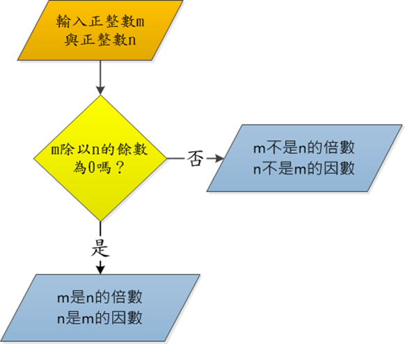

# 認識演算法

## 名稱由來

演算法\(Algorithm\)一詞源自一位的阿拉伯數學家:  阿布‧賈法‧穆罕默德‧賓‧穆薩‧阿爾‧可瓦里茲米\(Abu Jafar Muhammad ibn Musa al-Khwarizmi\) \(780 – 850 A. D.\)的拉丁文譯名\(al-Khwarizmi \)。

## 什麼是演算法

* 廣義的說，演算法是解決某一問題的一步一步程序\(a step-by-step procedure for solving a problem\) -- Merriam-Webster Dictionary
* 狹義的說，演算法是一個由一些步驟所構成的集合，依循這些步驟得以解決數學問題或完成計算機進程\(a set of steps that are followed in order to solve a mathematical problem or to complete a computer process\) -- Merriam-Webster Dictionary

## 嚴謹定義

演算法\(algorithm\)： 由有限\(finite\)步驟\(step\)所構成的集合，依照給定輸入\(input\)依序執行每個明確\(definite\)且有效\(effective\) 的步驟，以便能夠解決特定的問題；而步驟的執行必定會終止\(terminate\)，並產生輸出\(output\) 。

## 特性

根據演算法計算角度的嚴謹定義，演算法是由解決某一特定問題的步驟所組成，具有以下特性: 

* 指定輸入\(input\)：演算法必須指定輸入，可以由外界輸入0 個、1 個或多個資料。 
* 具有輸出\(output\)：演算法必定有至少1 個以上的輸出。 
* 有限性\(finiteness\)：演算法步驟的個數必須是有限的，而且步驟的執行最後會終止\(terminate\)。 
* 明確性\(definiteness\)：演算法的每個步驟都必須是明確\(definite\) 而不含糊的\(unambiguous\)。
*  有效性\(effectiveness\)：演算法的每個步驟必須是有效的\(effective\) 或說是可行的\(feasible\)。

## 例子

## 如何表示演算法?

* 自然語言\(中文或英文等語言\) 
* 流程圖\(flow chart\) 
* 虛擬碼\(pseudo code\)

## 歐幾里德演算法 \(Euclid Algorithm\)

### 自然語言

問題：給定二個正整數m及n，找出此二數的最大公因數GCD\(也就是能同時整除m及n的最大正整數\)  
                                                                                                                                                                                          解法：  
 步驟1.\[找出餘數\]         求出m除以n的餘數，並記錄於r。  
 步驟2.\[餘數為0嗎?\]      如果r=0則停止，輸出n為GCD。  
 步驟3.\[換被除數與除數\]  設定m=n,n=r，並跳至步驟1。

### 流程圖

### 虛擬碼\)

## pseudo code

虛擬碼以一種混雜著自然語言與高階程式語言結構的方式來描述演算法。                                                                                                                    可以達到簡潔易讀、容易分析，而且也容易轉換為高階程式語言的目的。

### 虛擬碼撰寫規則如下: 

* 演算法名稱及參數：以 Algorithm 演算法名稱 \(參數 1, 參數 2,…\) 來列出演算法名稱並指明其輸入參數。
* 輸入：以 Input 輸入描述 來進行輸入說明
* 輸出：以 Output 輸出描述 來進行輸出說明
* 設定：以 ← 表示，可以將一個算式 \(expression\) 的值指定給某一個變數 \(置入某變數中\)
* 算術運算：以 + − ∗ / % 表示加、減、乘、除、模 \(除法求餘數\)運算
* 比較與邏輯運算：以 = &gt; &lt; 表示等於、大於、小於等的運算，並使用^ˇ ~ 表示邏輯的且、或與反向的運算。
* 決策結構：以 if 條件 then 條件為真的動作 else 條件為偽的動作來表示。
* while 迴圈：以 while 條件 do 迴圈動作。
* for 迴圈：以 for 迴圈變數變動之範圍及其變動方式do 迴圈動作 來表示。
* 陣列元素索引：以 陣列名稱 \[i\] 代表命名為陣列名稱的陣列索引 \(index\) 為 i 的元素，一個有 n 個元素的陣列，其元素索引值為 0,1,…,n-1
* 演算法呼叫：以 演算法名稱 \(參數…\) 來表示演算法的呼叫
* 演算法返回: 以 return 返回值 來代表演算法結束執行並輸出返回值。

## 正確性

### 演繹法

演繹法\(deduction\)或演繹推理\(deductive reasoning\)或直接證明\(direct proof\) 證明思維: 利用邏輯推理，由已知的命題推導出下一個命題，如此一一推導出欲證明的命題為真。 我們在以下列出常見的演繹推理形式。 \(取材自維基百科: 演繹推理, [https://zh.wikipedia.org/wiki/%E6%BC%94%E7%BB%8E%E6%8E%A8%E7%90%86](https://zh.wikipedia.org/wiki/%E6%BC%94%E7%BB%8E%E6%8E%A8%E7%90%86)\)

### 歸納法

歸納法\(induction\)通常用於證明命題針對大於某個基礎值的自然數n均成立。

證明思維: 歸納基底\(induction base\):先證明當n等於基礎值n0時命題成立。 歸納假設\(induction hypothesis\): 假設當n=kn0時命題成立。 歸納步驟\(induction step\): 基於歸納假設推導\(deduce\)n=K+1時命題也成立。 最後根據歸納原則\(induction principle\)即可證明當n大於或等於基礎值n0時命題都成立。

### 矛盾法\(反證法\)

矛盾法\(contradiction\)也稱反證法 證明思維:欲證明某命題為真，則先假設該命題為假，若能由假設推理導致邏輯上的矛盾，則能夠 證明最初的假設錯誤，也就是證明原命題為真。

